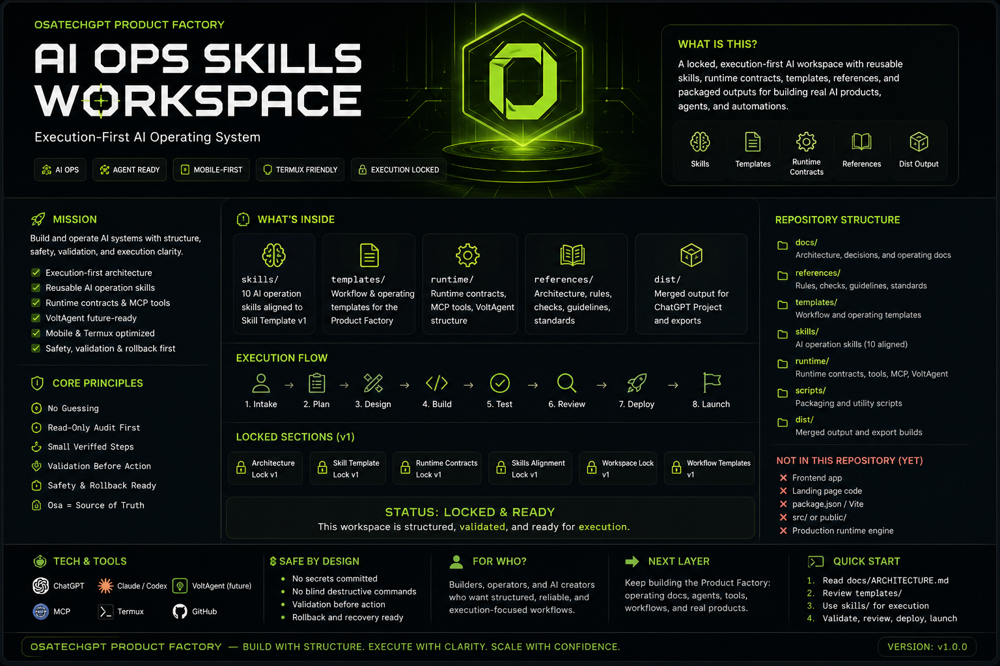

<p align="center">
  
</p>

# AI Ops Skills Workspace

**AI Ops Skills Workspace** is the execution-first operating layer for OsaTechGPT Product Factory.

It stores reusable AI skills, workflow templates, runtime contracts, operating rules, and packaged outputs for building serious apps, agents, automations, dashboards, Web3 tools, and business systems without chaos.

This repository is **not** a frontend app, landing page repo, SaaS app, or production runtime engine yet.

---

## Status

| Layer | Status |
|---|---|
| Architecture Lock v1 | Done |
| Skill Template Lock v1 | Done |
| Runtime Contracts Lock v1 | Done |
| Packaging / dist rebuild | Done |
| Skills Alignment Lock v1 | Done |
| Product Factory Workspace Lock v1 | Done |
| Workflow Templates v1 | Done |
| README Lock v1 | Done |

---

## Core Rule

No guessing.

If project-specific information is missing, ask Osa or run a read-only audit first.

Osa is the source of truth for repo names, paths, tools, APIs, keys, deployment targets, architecture decisions, and project constraints.

---

## Repository Structure

```text
ai-ops-skills/
├─ assets/readme/
├─ docs/
├─ references/
├─ templates/
├─ skills/
├─ runtime/
├─ scripts/
├─ dist/
└─ README.md
